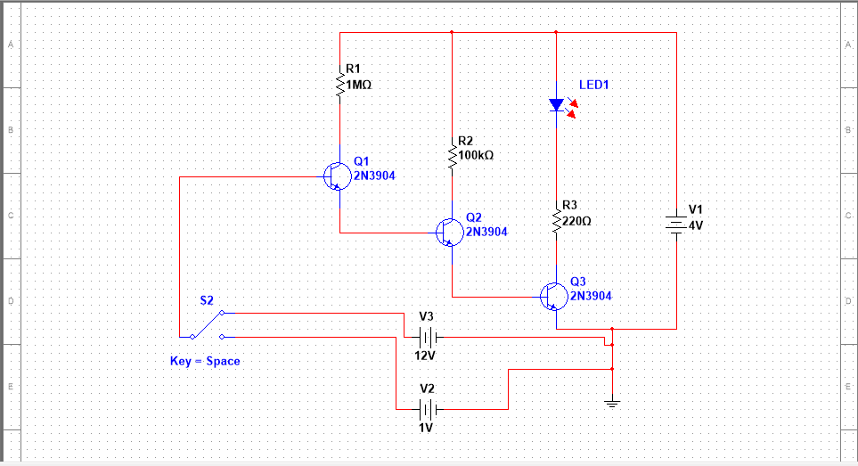
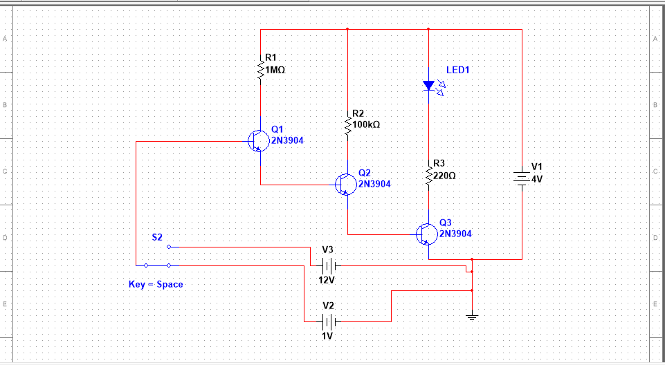

<h1 align="center"> Wireless Voltage Detector<h1>

<h1>Itroduction</h1>
 
Electricity has become a basic need for humanity as almost everything we use in our daily life run on it. But if you do not take necessary safety precautions while working with electricity or electrical appliances, it can cause severe injuries or even death.
So, before working with AC Mains supply near junction boxes like installing a new device for example, you must turn off the supply and verify that there is no voltage in the switch board.

Voltage Testers are devices that detects and indicates presence of voltage in power cables, electrical cords, lighting fixtures, circuit breakers, wires, power outlets etc. A Non Contact Voltage Tester, as the name suggests, is a voltage detector device that doesn’t need any contact with cables, cords or outlets.

In this project, I have designed a simple battery powered Non Contact Voltage Tester Circuit that can be used to verify the presence of voltage near all the above mentioned places.

 
<h1>Principle of Operation</h1>

Any current carrying conductor produces a small magnetic field around it and the type of magnetic field depends on the type of current passing through the conductor. For example, if AC (alternating current) is flowing through the conductor, then the magnetic field around the conductor also varies periodically.

The principle of this circuit is to detect this varying magnetic field and indicate whether voltage is present or not.

In order to detect the voltages, I will be using three NPN Transistors. Depending on the amount of base current, the collector – to – emitter current is determined in a transistor. The ratio of collector – emitter current to base current is known as Gain and in case of 2N3904 (which is the transistor used in this project), this value is approximately 200.

If the output of one transistor is connected to base of the next transistor, the net gain is the product of individual gains.

Similarly, if we add another transistor, the total gain is gain of single transistor raised to the power of 3 (200x200x200)

<h1>Circuit Diagram</h1>

<h1>Components required</h1>

* NPN Transistors – 2N3904 X 3
* 1MΩ Resistor
* 100KΩ Resistor
* 220Ω Resistor
* 5mm LED
* Small piece of copper wire wound as antenna
* 3V CR2032 Battery with holder
* Small perf board

<h1>Circuit Working</h1>

when the base of the first transistor gets or detects 12V supply the led will turns on.That means high leakage current present through the wire.

Since the output of the first transistor drives the second transistor, it gets activated as so on. As the third transistor is activated, the LED is turned ON indicating the presence of a voltage.

Additionally, you can place a small buzzer in series with the LED so that it is activated whenever the circuit detects any voltage. 
when the circuit detetcts Low voltage i.e 1 V led remains off or turned off.

<h1>Results</h1>

When the Voltage is 12V Led Turned On

 

When the Voltage is 1V Led Turned On

<h1>Applications</h1>
<!-- This simple Non Contact Voltage Tester can be used in several places and near several objects like cables, cords, outlets, switch boards, junction boxes, circuit breakers etc. to detect voltage without making any contact.
<!-- 
* Since it is battery operated, you can insert the circuit is a small box and make it portable.
* It can be used in various fields like security, communication, irrigation, entertainment, environment etc. --> 
This simple Non Contact Voltage Tester can be used in several places and near several objects like cables, cords, outlets, switch boards, junction boxes, circuit breakers etc. to detect voltage without making any contact.

It can be used in various fields like security, communication, irrigation, entertainment, environment etc

